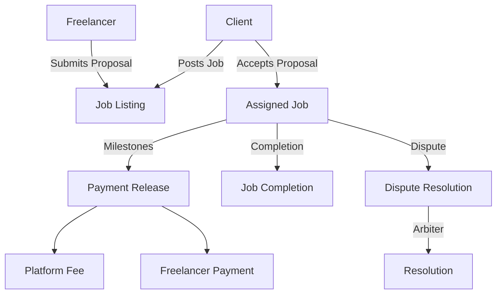

# FlexHive Work Marketplace

A decentralized marketplace built on Stacks that connects skilled freelancers with clients seeking short-term work or gig-based services. FlexHive eliminates traditional intermediaries, reducing fees while providing security and transparency through smart contract enforcement.

## Overview

FlexHive enables:
- Clients to post jobs with detailed requirements and compensation terms
- Freelancers to browse opportunities and submit proposals
- Secure escrow and milestone-based payments
- Reputation tracking and dispute resolution
- Platform fee of 2.5% (significantly lower than traditional platforms)

## Architecture



The system uses multiple data maps to track:
- Job listings and their current status
- Proposals from freelancers
- Milestone payments and completion
- Disputes and resolutions
- User profiles and reputation scores

## Contract Documentation

### Main Contract: flexhive-marketplace

Core functionalities:

1. **Job Management**
   - Post new jobs with escrow
   - Submit and accept proposals
   - Milestone creation and payment
   - Job completion and payment release

2. **Payment Handling**
   - Secure escrow of funds
   - Milestone-based payments
   - Platform fee collection
   - Bonus payment support

3. **Dispute Resolution**
   - Dispute initiation
   - Evidence submission
   - Arbiter assignment
   - Resolution and fund distribution

## Getting Started

### Prerequisites
- Clarinet installation
- Stacks wallet
- STX tokens for transactions

### Basic Usage

**1. Posting a Job**
```clarity
(contract-call? .flexhive-marketplace post-job 
    "Job Title" 
    "Job Description" 
    u1000 ;; amount in STX
    u100   ;; deadline block height
)
```

**2. Submitting a Proposal**
```clarity
(contract-call? .flexhive-marketplace submit-proposal 
    u1 ;; job-id
    "Proposal details" 
    u900 ;; proposed amount
    u90  ;; proposed deadline
)
```

**3. Accepting a Proposal**
```clarity
(contract-call? .flexhive-marketplace accept-proposal 
    u1 ;; job-id
    'SP2J6ZY48GV1EZ5V2V5RB9MP66SW86PYKKNRV9EJ7 ;; freelancer address
)
```

## Function Reference

### Client Functions
- `post-job`: Create new job listing
- `accept-proposal`: Accept freelancer's proposal
- `add-milestone`: Create payment milestone
- `release-milestone-payment`: Release milestone payment
- `approve-job-completion`: Approve and finalize job
- `add-bonus-payment`: Add bonus compensation

### Freelancer Functions
- `submit-proposal`: Submit job proposal
- `submit-job-completion`: Mark job as complete

### Dispute Functions
- `initiate-dispute`: Start dispute process
- `submit-dispute-evidence`: Submit evidence
- `resolve-dispute`: Resolve dispute (arbiter only)

## Development

### Testing
Run tests using Clarinet:
```bash
clarinet test
```

### Security Considerations

1. **Fund Safety**
   - All funds are held in escrow
   - Milestone-based releases
   - Dispute resolution mechanism

2. **Access Control**
   - Role-based function access
   - Validation of principals
   - Status-based operation checks

3. **Edge Cases**
   - Deadline enforcement
   - Payment validation
   - Status transitions

### Important Limitations
- Dispute resolution requires approved arbiters
- Platform fee is fixed at 2.5%
- Job modifications after posting are limited
- All amounts are in STX tokens only